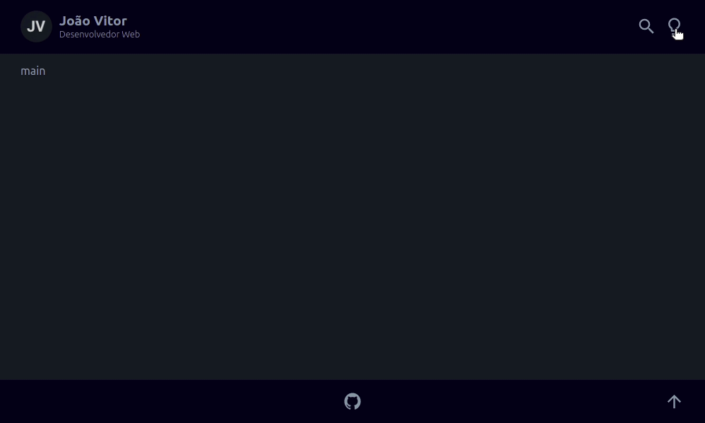

# Como criar um blog - Parte 1

Nesse tutorial, vamos aprender passo a passo como criar um blog com [Gatsby](https://www.gatsbyjs.com/), [GraphQL](https://graphql.org/), [TypeScript](https://www.typescriptlang.org/), entre outras tecnologias.

## Iniciando o projeto

Escolha um diretório e execute os seguintes comados no terminal, para criar e executar um novo projeto:

```shell
$ gatsby new blog
$ cd blog
$ gastby develop
```

> https://www.gatsbyjs.com/docs/how-to/local-development/starters/

## Configurações do TypeScript

Instale os plugins para utilizar o TypeScript:

```shell
$ yarn add -D @types/react @types/react-dom @types/node
```

Inclua as seguintes configurações no arquivo `gatsby-config.js`

```js
// gatsby-config.js
module.exports = {
  plugins: [
    {
      resolve: `gatsby-plugin-typescript`,
      options: {
        isTSX: true, // defaults to false
        jsxPragma: `jsx`, // defaults to "React"
        allExtensions: true, // defaults to false
      },
    },
  ],
}
```

> https://www.gatsbyjs.com/plugins/gatsby-plugin-typescript/

## Layout

O Layout desse projeto foi desenvolvido no [Figma](https://www.figma.com/file/LnOniseTEpfqsKc5cIrOlb/blog?node-id=0%3A1), tendo como inspiração os blogs do [Willian Justen](https://willianjusten.com.br/) e [Felipe Fialho](https://www.felipefialho.com/), e também, o tema dark do [GitHub](https://github.com/diasjoaovitor). A partir daí, podemos partir para o código.

O primeiro passo, é criar o componente `Layout` que englobará o `Header` e o `Footer`.

Porém, antes disso, precisamos fazer algumas coisas:

- instalar o plugin [styled-components](https://www.gatsbyjs.com/docs/how-to/styling/styled-components/) para definir as propriedades de estilo que vamos utilizar no projeto:

```shell
$ yarn add gatsby-plugin-styled-components styled-components babel-plugin-styled-components
$ yarn add @types/styled-components -D
```
```js
// gatsby-config.js
module.exports = {
  plugins: [`gatsby-plugin-styled-components`],
}
```

- criar o arquivo para redefinir as propriedades de estilo padrão do navegador, usando o [CSS Reset do Mayer](https://meyerweb.com/eric/tools/css/reset/) e atribuir novos estilos globais personalizados

- definir o tema dark como padrão: 

```shell
$ cp .cache/default-html.js src/html.js
```

> https://www.gatsbyjs.com/docs/custom-html/
> https://markoskon.com/dark-mode-in-react/

- instalar o [styled-icons](https://styled-icons.dev/) para os ícones que vamos utilizar:

```shell
$ yarn add styled-icons
```

- instalar o [gatsby-plugin-image](https://www.gatsbyjs.com/plugins/gatsby-plugin-image/) para o componente de imagem do avatar:

```shell
$ yarn add gatsby-plugin-image gatsby-plugin-sharp gatsby-transformer-sharp

```
- instalar o [gatsby-plugin-transition-link](https://www.gatsbyjs.com/plugins/gatsby-plugin-transition-link/) para as transições de página

```shell
$ yarn add gatsby-plugin-transition-link gsap
```

```js
// gatsby-config.js
module.exports = {
    plugins: [
      `gatsby-plugin-transition-link`
    ]
]
```

Pra finalizar essa primeira parte, vamos aproveitar para implementar logo a função de troca entre os temas dark e light

Então, temos isso:


